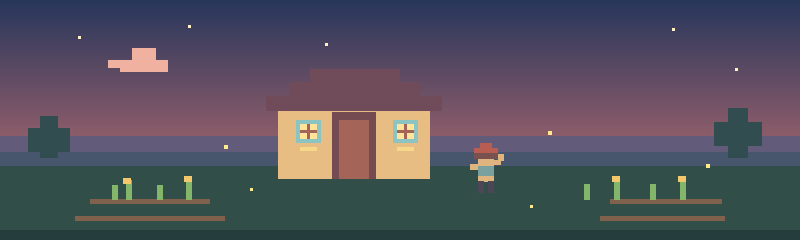

# 🌾 Xin chào, mình là [Tên của bạn]!

> Một góc nhỏ của mình trên GitHub — nơi mình gieo ý tưởng, chăm chút dự án và học thêm điều mới mỗi ngày. 🌱

## 🧑‍🌾 Về mình

- 👋 Mình là **[Tên của bạn]**, đến từ **[Thành phố / Quốc gia]**.
- 💻 Mình đang tìm hiểu **[lĩnh vực hoặc công nghệ bạn quan tâm]**.
- 🌻 Mình thích **[sở thích]**, làm dự án nhỏ và biến ý tưởng thành sản phẩm.
- 🔭 Hiện mình đang xây dựng: **[Tên dự án hoặc mục tiêu hiện tại]**.
- 📮 Liên hệ: **[email của bạn]**

## 🧰 Đồ nghề trong ba lô

`[Ngôn ngữ lập trình]` · `[Framework]` · `[Công cụ]`

## 🗺️ Nhật ký hành trình

| Mùa | Mục tiêu |
| --- | --- |
| 🌱 Đang gieo hạt | [Kỹ năng hoặc dự án bạn đang học/làm] |
| ☀️ Đang chăm vườn | [Việc bạn muốn hoàn thành tiếp theo] |
| ⭐ Ước mơ | [Mục tiêu dài hạn] |

## 🔗 Tìm mình ở đâu

- GitHub: [@ten-github-cua-ban](https://github.com/ten-github-cua-ban)
- LinkedIn: [Trang cá nhân](https://www.linkedin.com/)
- Email: [Gửi email](mailto:email-cua-ban@example.com)

---

<i>Cảm ơn bạn đã ghé thăm nông trại nhỏ của mình. Chúc bạn một ngày thật dịu dàng! 🌙</i>

