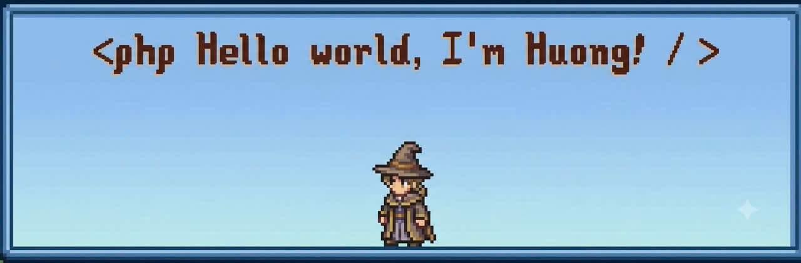

  

## 💫 About Me

- 🍢 Favorite food: **nem nướng**
- 🎮 I enjoy cozy games and pixel art.
- 🌱 Currently learning: **PHP**

## 🌐 Socials

  
  
  
  

## 💻 Tech Stack

| Languages | Web | Tools |
|:---:|:---:|:---:|
|  |  |  |

  

---

Thanks for stopping by!

